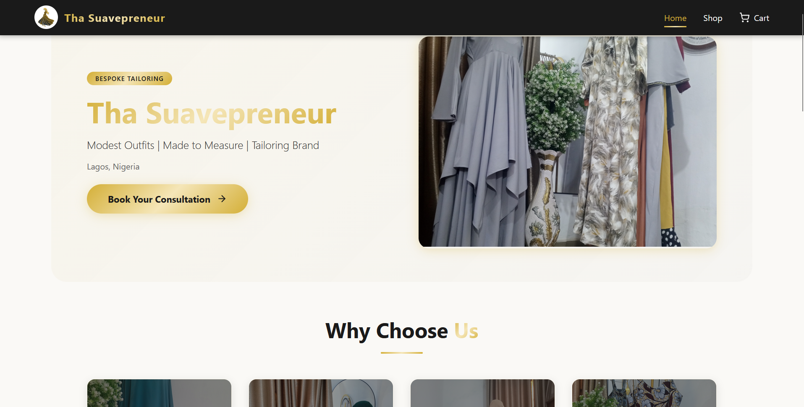

# 👑 Tha Suavepreneur - Shopping Cart

[](https://tha-suavepreneur-store.pages.dev/)
[](https://github.com/Okoro91/tha-suavepreneur-store)
[](https://react.dev/)
[](https://vitejs.dev/)

A modern e-commerce shopping cart application for **Tha Suavepreneur** – a premium modest fashion and made-to-measure tailoring brand based in Lagos, Nigeria.



## ✨ Features

- 🏠 **Home Page** – Brand showcase with professional fashion content
- 🛒 **Shop Page** – Dynamic product cards with real-time updates
- 📦 **Cart Management** – Full CRUD operations with live updates
- ➕➖ **Quantity Controls** – Increment, decrement, and manual input
- 📱 **Fully Responsive** – Seamless experience on all devices
- 🧪 **Comprehensive Testing** – Unit tests with Vitest
- 🎨 **Premium Design** – Gold theme with custom CSS modules
- 🔄 **React Router v7** – Seamless navigation
- 📊 **Live Cart Badge** – Real-time item count in navbar

## 🛠️ Tech Stack

### Core

- **React 19** – Latest React with modern features
- **Vite 6.0** – Blazing fast build tool
- **React Router DOM 7** – Declarative routing

### UI & Styling

- **Material UI 6** – Component library
- **Lucide React** – Beautiful icon set
- **CSS Modules** – Scoped and maintainable styles

### Testing

- **Vitest 2** – Unit testing framework
- **React Testing Library** – Component testing
- **JSDOM** – DOM environment for tests

### Deployment

- **Cloudflare Pages** – Global CDN deployment

## 📁 Project Structure

tha-suavepreneur-store/
├── public/
│ └── \_redirects # SPA routing configuration
├── src/
│ ├── assets/ # Images, fonts, etc.
│ ├── components/
│ │ ├── Navbar/ # Navigation with cart badge
│ │ ├── ProductCard/ # Product cards with quantity controls
│ │ └── CartItem/ # Cart item components
│ ├── pages/
│ │ ├── Home/ # Brand showcase
│ │ ├── Shop/ # Product grid
│ │ └── Cart/ # Cart management
│ ├── context/
│ │ └── CartContext.jsx # Global cart state
│ ├── services/
│ │ └── api.js # FakeStore API integration
│ ├── test/ # Centralized test files
│ │ ├── setup.js
│ │ ├── components/
│ │ ├── pages/
│ │ ├── context/
│ │ └── services/
│ ├── App.jsx
│ ├── Routes.jsx
│ └── main.jsx
├── index.html
├── package.json
├── vite.config.js
├── vitest.config.js
└── vercel.json # Vercel deployment config
text

## 🚀 Getting Started

### Prerequisites

- Node.js (v18 or higher)
- npm or yarn

### Installation

1. **Clone the repository**

```bash
git clone https://github.com/Okoro91/tha-suavepreneur-store.git
cd tha-suavepreneur-store

    Install dependencies

bash

npm install

    Start development server

bash

npm run dev

    Open your browser
    Visit http://localhost:5173 to see the app.

Available Scripts
bash

# Development
npm run dev          # Start dev server
npm run build        # Build for production
npm run preview      # Preview production build

# Testing
npm run test         # Run tests in watch mode
npm run test:ui      # Run tests with UI
npm run test:run     # Run tests once
npm run test:coverage # Run tests with coverage report

# Linting
npm run lint         # Run ESLint

🧪 Testing

The project uses Vitest with React Testing Library for comprehensive unit testing.
bash

# Run all tests
npm run test:run

# Run with coverage
npm run test:coverage

# Interactive UI
npm run test:ui

Test files are centralized in the src/test/ directory:

    components/ – Component tests

    pages/ – Page tests

    context/ – Context tests

    services/ – API tests

🌐 Deployment
Cloudflare Pages (Current)

The site is live at: https://tha-suavepreneur-store.pages.dev/
Vercel Deployment

Create a vercel.json file in the root:
json

{
  "rewrites": [
    {
      "source": "/(.*)",
      "destination": "/index.html"
    }
  ]
}

Netlify Deployment

Create a public/_redirects file:
text

/* /index.html 200

🎨 Brand Design
Color Palette
Color	Hex	Usage
Gold Primary	#d4af37	Buttons, accents, icons
Gold Light	#f5e6b8	Hover states, highlights
Gold Dark	#b8960f	Active states
Black	#1a1a1a	Text, navbar
White	#ffffff	Backgrounds, cards
Light Grey	#f5f5f5	Page background
Typography

    Primary Font: System font stack

    Brand Name: Gold gradient text

    Headings: Bold with gold accents

📱 Responsive Design

The application is fully responsive across all screen sizes:

    Desktop – Full layout with sticky cart summary

    Tablet – Adjusted grid and spacing

    Mobile – Single column layout with touch-friendly controls

🤝 Contributing

Contributions are welcome! Please follow these steps:

    Fork the repository

    Create a feature branch (git checkout -b feature/AmazingFeature)

    Commit your changes (git commit -m 'Add some AmazingFeature')

    Push to the branch (git push origin feature/AmazingFeature)

    Open a Pull Request

📄 License

This project is proprietary and owned by Tha Suavepreneur.
👤 Author

Okoro MI – GitHub
🙏 Acknowledgments

    FakeStore API for product data

    Material UI for component library

    Lucide for beautiful icons

    Cloudflare Pages for hosting

📞 Contact

Tha Suavepreneur

    📍 Lagos, Nigeria

    📱 WhatsApp

    📷 Instagram

Built with ❤️ using React, Vite, and Vitest
```
